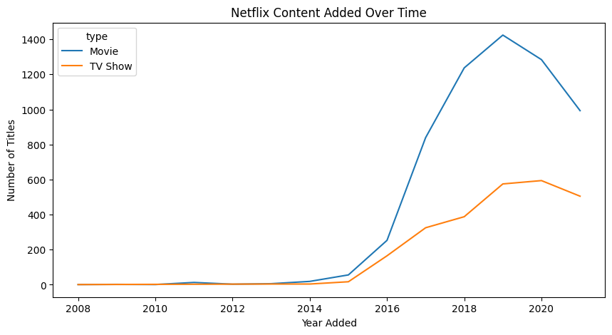

# NetFlix-EDA-data-science :
# 📊 Netflix Content Analysis (EDA)
This project explores trends in Netflix's catalog using data visualization. We examine how Netflix content has evolved over time by type, genre, country, and more.
# Dataset Link :
https://www.kaggle.com/datasets/shivamb/netflix-shows 
# 🧠 Objective:
Understand what kind of content is Netflix producing over time — Analyze the trends in Netflix’s content catalog — TV Shows vs. Movies, genres, and countries — using basic data science skills like data cleaning, visualization, and insights generation.
# Objective Questions to Answer:
 * Is Netflix producing more TV Shows or Movies over time?
 * What are the most common genres?
 * How has content production changed by year? dec or incr
 * Which countries produce the most Netflix content? active countries
 * Skills Involved: EDA, visualization, time-series analysis

# 🟠 A. Is Netflix producing more TV Shows or Movies over time?

Since 2015, there has been a general increase in the number of titles produced by Netflix. Starting in 2016, the number of movies produced began to increase more significantly than TV shows, and this trend continued over the next several years (2016–2020).  Movies have dominated with fast increase until 2019, but also TV Shows have steadily increased especially from 2018 onward.
This suggests that during this period, Netflix shifted its focus more toward movies, likely due to rising audience demand, production flexibility, or strategic goals.
However, it's important to note that after 2019, the overall number of new titles started to decrease, which might be related to external factors such as market saturation or the impact of the COVID-19 pandemic on production schedules.
In recent years, Netflix seems to be balancing TV Shows and Movies production.

#
#
#
#
#
