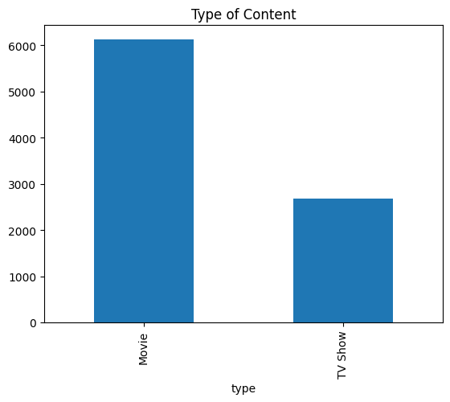
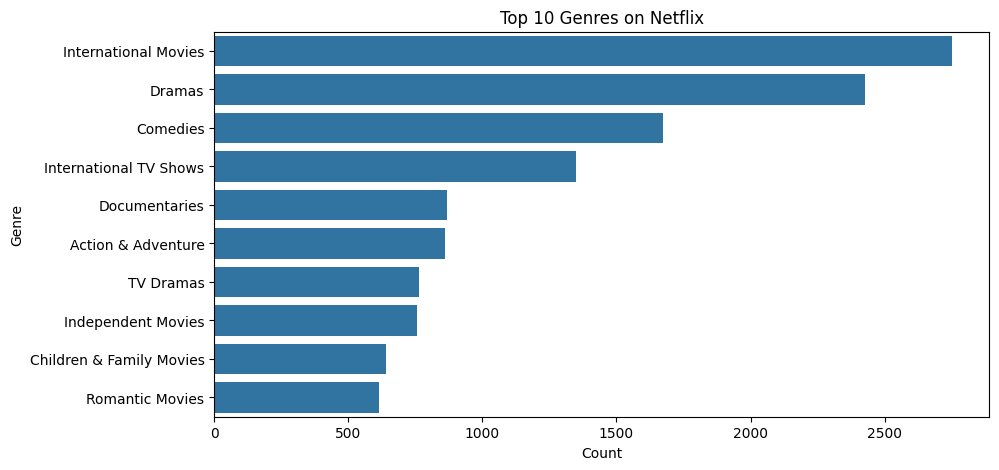
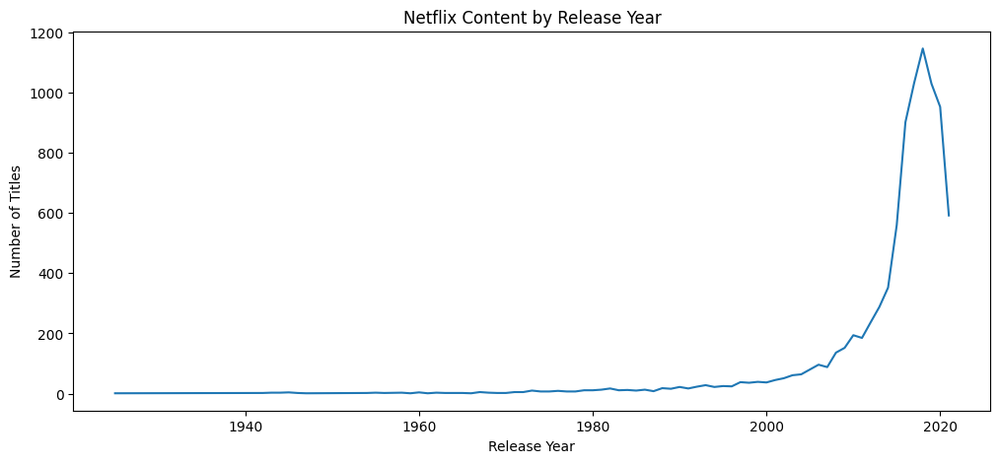
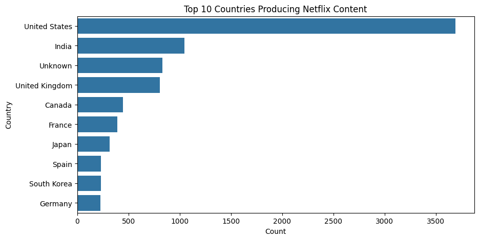
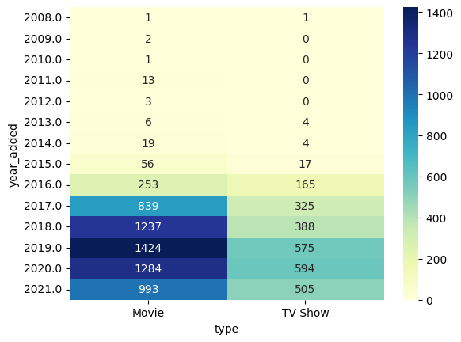
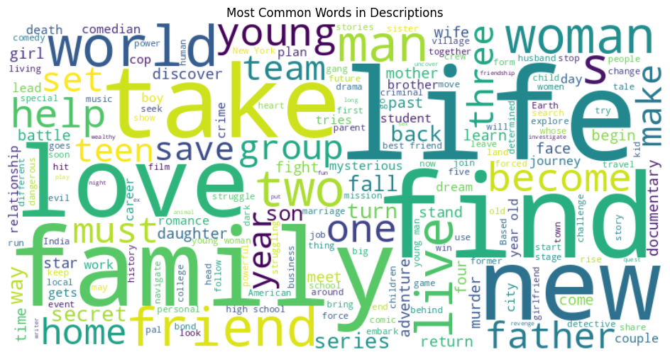
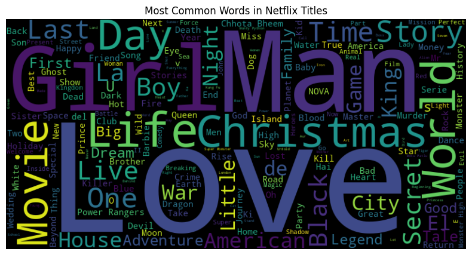

# NetFlix-EDA-data-science :
# 📊 Netflix Content Analysis (EDA)
This project explores trends in Netflix's catalog using data visualization. We examine how Netflix content has evolved over time by type, genre, country, and more.
# Dataset Link :
https://www.kaggle.com/datasets/shivamb/netflix-shows 
# 🧠 Objective:
Understand what kind of content is Netflix producing over time — Analyze the trends in Netflix’s content catalog — TV Shows vs. Movies, genres, and countries — using basic data science skills like data cleaning, visualization, and insights generation.
# Objective Questions to Answer:
 * Is Netflix producing more TV Shows or Movies over time?
 * What are the most common genres?
 * How has content production changed by year? dec or incr
 * Which countries produce the most Netflix content? active countries
 * Skills Involved: EDA, visualization, time-series analysis

# 🟠 A. Is Netflix producing more TV Shows or Movies over time?

Since 2015, there has been a general increase in the number of titles produced by Netflix. Starting in 2016, the number of movies produced began to increase more significantly than TV shows, and this trend continued over the next several years (2016–2020).  Movies have dominated with fast increase until 2019, but also TV Shows have steadily increased especially from 2018 onward.
This suggests that during this period, Netflix shifted its focus more toward movies, likely due to rising audience demand, production flexibility, or strategic goals.
However, it's important to note that after 2019, the overall number of new titles started to decrease, which might be related to external factors such as market saturation or the impact of the COVID-19 pandemic on production schedules.
In recent years, Netflix seems to be balancing TV Shows and Movies production.

here we can see the big difference in the production between movies and tv shows , which explain what we said before . 

# 🟠 B. Most Common Genres

We can observe that International Movies rank at the top, with over 2,500 titles, closely followed by Dramas, which also have around 2,500 titles. This suggests that during this period, there may have been a trend or growing interest in content that explores different cultures and storytelling styles from around the world.

Comedies and International TV Shows have nearly the same number of titles, with comedies slightly ahead. This could indicate that audiences are drawn to light-hearted content, possibly as a way to cope with the pressures of everyday life and work.

Documentaries, Action, and Adventure genres share similar counts, showing a balanced interest in informative and high-energy entertainment.

Similarly, TV Dramas and Independent Movies have roughly the same number of titles, suggesting steady production and interest in more serious or artistic content.

At the bottom of the list, we find Children & Family Movies and Romantic Movies, indicating that these genres are less represented in the dataset, possibly reflecting lower production or niche audiences on Netflix.
 * The most popular genres on Netflix are International Movies, Dramas, and Comedies.
 * Netflix focuses heavily on drama and comedy, which appeals to a broad audience.

# 🟠 C. How Has Production Changed by Release Year

We can observe a growth in Netflix's content production starting from the year 2010, with a particularly noticeable increase around 2015–2016. However, in 2019, there is a slight decline in the number of productions — possibly due to the pandemic.
Older content (before 2000) is less represented, showing Netflix focuses on newer releases.

# 🟠 D. Top Producing Countries

1/ We can see that the United States is leading with over 3,500 titles is by far the largest producer of Netflix content, indicating that Netflix places a strong focus on American content, likely due to its U.S origin and the global popularity of Hollywood productions.

2/ Next, India has over 1,000 titles,This reflects Netflix’s strategic expansion into the Indian market, recognizing the country’s massive viewership and regional diversity, especially compared to other countries.

3/ Around 800 titles are labeled as coming from an unknown country.This suggests either missing metadata or multi-country productions where no primary country is assigned.

4/ Following that, the United Kingdom has closer to 800 titles, while Canada has about 500 titles.

5/ France and Japan each have approximately 400 titles.
6/ Meanwhile, Germany, South Korea, and Spain each have around 250 titles, showing a moderate level of content production from these countries.

# 🔵 Movies & Tv Shows added Year :

In 2019, Netflix added more movies than in any other year, with a total of 1,424 movie titles. In contrast, the highest number of TV shows was added in 2020, with 594 titles.

This suggests that in recent years, Netflix has been focusing more on movies. From 2009 to 2012, no TV shows were added to the platform—Netflix's content was entirely composed of movies, though the number of additions remained relatively low.

From 2008 to 2015, the overall trend shows a stronger emphasis on movies rather than TV shows. However, between 2016 and 2020, both content types saw significant growth, though movies still dominated.

This shift in focus might be due to audience demand. Many viewers prefer the quick, self-contained storytelling of movies, which typically last around 2 hours, compared to TV shows that may span dozens of episodes and require a longer time commitment.

# ☁️ WordCloud: Description

Common words in descriptions include : 'life', 'love', 'family', 'woman', 'young','home','father','help','world'.

This reflects Netflix’s focus on drama and personal stories between family or couples. 

# ☁️ WordCloud: Titles

Common words in descriptions include : 'love','christmas','girl','world','movie','day','last','story'.

